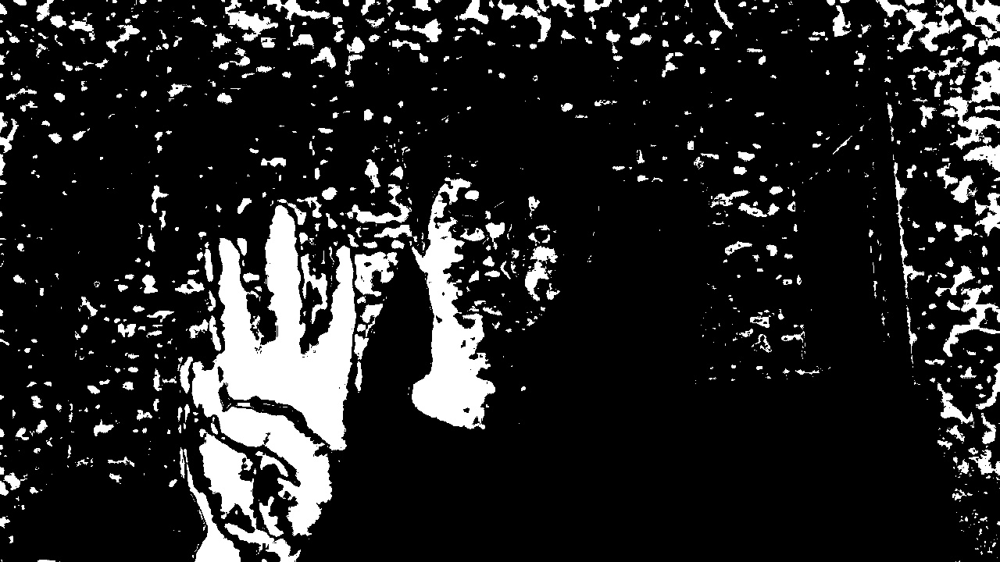
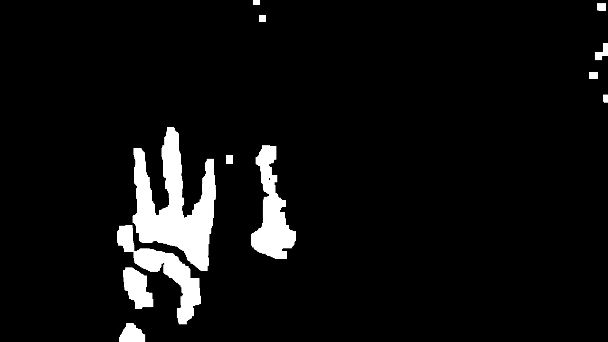

# Dino Game Controller Using Hand Gestures

This project contains Python code that allows you to control the Chrome Dino game using a webcam and hand gestures. The code is divided into three main sections, each addressing a specific task in the process: detecting the hand, recognizing gestures, and controlling the game.

## Project Overview
The goal of this project is to create a fun and interactive way to play the Chrome Dino game using just hand movements. By utilizing computer vision techniques, this project recognizes different hand gestures and translates them into game actions. Below is a detailed breakdown of the implementation and the techniques used in each section.

---

## Part 1: **Hand Detection (`part1.py`)**

The first step involves detecting the hand in the video feed. This part is based on the paper titled *"Hand Gesture Recognition with Skin Detection and Deep Learning Method"* by Hanwen Huang et al. The method uses **skin detection** to isolate the hand region in the image.

### Implementation:

1. **Skin Detection Using Color Segmentation**:  
   The original paper defines three color masks for different skin tones. However, I found that the paper’s implementation has limitations, such as poor performance in varying lighting conditions and difficulty in differentiating similar background colors. As a result, I improved the model by dynamically adjusting the skin detection boundaries based on real-time sampling of the user's skin color.

2. **Morphological Operations for Noise Removal**:  
   After detecting the skin region, I apply morphological operations to remove noise and smooth the hand's contour.

3. **Dynamic Calibration**:  
   The program allows the user to capture a sample of their hand at the start to calibrate the detection model, making it more robust to changes in lighting and skin tone.

### Example Output:

#### Initial Hand Detection:

In this initial detection, background elements are falsely recognized as hand regions.

#### Improved Detection After Calibration:

After refining the model and applying additional filters, the hand is correctly segmented, with minimal background interference.
#### detect hand by finding biggest area

#### crop

---

## Part 2: **Gesture Recognition (`part2.py`)**

Once the hand is detected, the next step is to recognize specific gestures to control the game. The gesture recognition module differentiates between an open hand (to jump) and a closed fist (no action).

### Implementation:

1. **Edge Detection Using Canny Transform**:  
   I applied Canny edge detection to highlight the hand's outline. This transformation makes it easier to identify the key features of each gesture.

2. **Counting Lines with Hough Transform**:  
   The primary distinguishing feature between an open and a closed hand is the number of lines present in the image:
   - Open Hand: Contains many intersecting lines.
   - Closed Fist: Contains fewer lines.

   I used the Hough Transform to count the number of lines in the image and classified the hand based on a threshold value.

3. **Gesture Classification**:  
   If the number of lines is greater than 5, the hand is classified as "Open," which triggers a jump action in the game. If the count is lower, no action is taken.

### Example Output:

#### Canny Edge Detection:

This image shows the edge detection result for an open hand, clearly highlighting its structure.

#### Line Detection with Hough Transform:

The detected lines are overlaid in blue. Based on the number of lines, the system identifies the gesture as "Open Hand."

---

## Part 3: **Game Control (`part3.py`)**

The final part of the project integrates the hand detection and gesture recognition modules to control the Chrome Dino game.

### Implementation:

1. **Connecting to the Game**:  
   The program uses keyboard emulation to send the `Space` key command to the Dino game based on the recognized hand gesture.

2. **Real-Time Control**:  
   After the initial setup, the program runs continuously, updating the game control based on real-time webcam input. The Dino jumps whenever an open hand is detected.

3. **Gesture Feedback and Game Interaction**:  
   The program provides visual feedback in the console, indicating which gesture was recognized and the corresponding game action.

---

## How to Run the Project

1. Open Google Chrome and go to `chrome://dino`.
2. Run the script `part3.py` and position your hand in front of the webcam to capture a sample.
3. Follow the on-screen instructions to start the game.
4. Use hand gestures (open hand for jumping) to control the Dino.

---

## Key Features:

- **Real-Time Hand Detection**: Uses skin detection with dynamic calibration for improved performance.
- **Simple Gesture Recognition**: Employs edge and line detection to classify gestures without complex machine learning models.
- **Robust Game Control**: Adapts to different lighting conditions and skin tones.

Feel free to explore and contribute to the project!

---
